# happyfeed

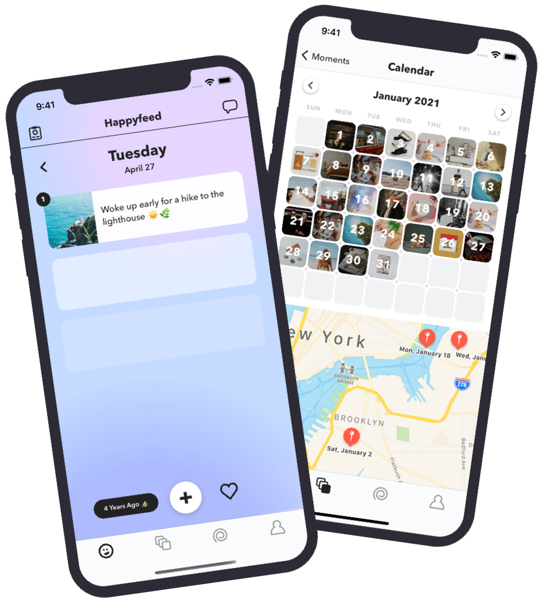

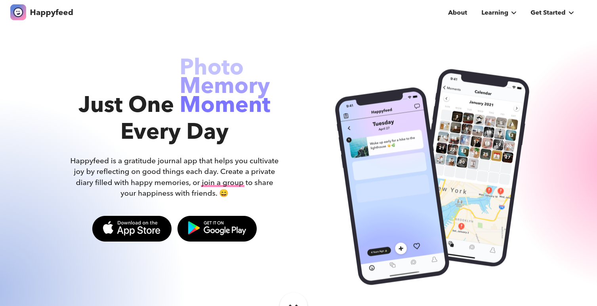

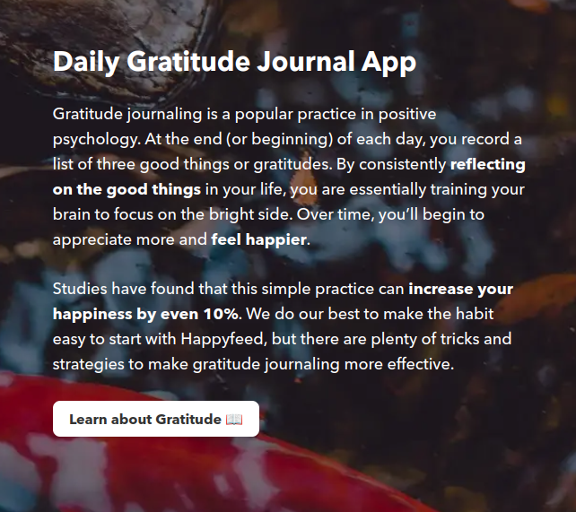

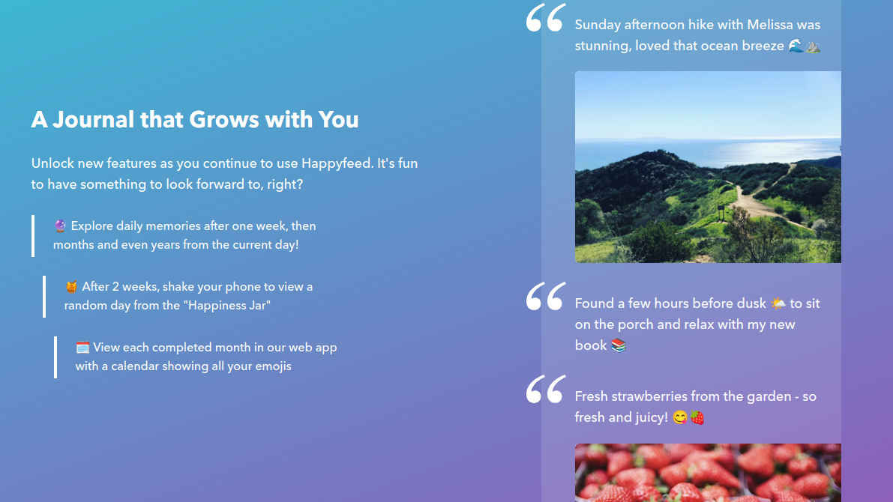

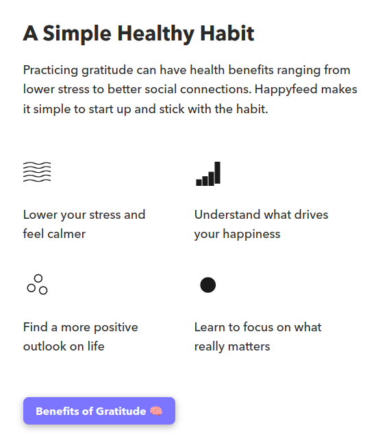

## about

### Our Story

#### Concept

Happyfeed was designed & built by me, [Matt Kandler](https://twitter.com/mattkandler), to solve my own problem. While co-founding another (now failed) startup, I got hooked on positive psychology to help balance the stress of trying to launch a product. One of the most common mood-boosting practices is called "3 good things" or [gratitude journaling](https://www.happyfeed.co/research/what-is-a-gratitude-journal). This is the act of recording and reflecting on three positive moments (or things you are grateful for) each night. I started writing in a basic Google doc, but I noticed some problems:

- Notebooks get lost, filled up, ruined in the wash, dropped in the mud, or read by your roommate. Why not use your phone? It's secure, can sync to the cloud, makes it easy to add photos, and can be accessed anytime.
- Forming a new habit is tough, especially with barriers like finding your misplaced notebook, searching for a Google doc, or opening Microsoft Word on your ancient computer. Most people fall asleep with their phone just inches away (another big problem).
- Looking through old journals is a such a joy, but how often do we actually do this? With an app, you can create ways easily surface the past moments that really mattered.

The first version of Happyfeed was a simple iOS app - you couldn't even edit or delete moments. Nevertheless, people discovered and started using it. Since then, I've had conversations with hundreds of journalers that have led to all sorts of new features ranging from an edit button to the [Happiness Jar](https://www.happyfeed.co/blog/happiness-jar).

#### Mission

Happyfeed was created by an engineer with a passion for design and love of experimentation. Every new feature is constantly improved upon and takes advantage of the latest technologies. **We value feedback from our users above all else.** Though we may not build every single suggestion, each conversation helps us learn more about how Happyfeed is used and how to steer the product in the right direction.

We recognize that **technology has the power to both help and harm our mental health**. When we see a beautiful sunset, we shouldn't worry about how many likes it could get us. Instead, we should learn to savor that feeling and remember that little moments like that exist everywhere.

We believe that **mental health is better with support**. Friendship and social support are major factors in our well-being and happy moments *should be* shared (appropriately). We're constantly trying to find the balance between creating private memories and selective sharing to enhance those moments.

Our goal is to **build something that stays with you for as long as you’d like** to find more happiness. We get excited about finding new ways to bring positive psychology research into simple, delightful experience in our little app.

#### We're in this together

Happyfeed is still a young product, but we are thrilled to have some very passionate users. More people helping out means more happiness. That could mean adding new features, keeping our community connected, or just using the product and telling your friends.

To get involved [send us a message](mailto:hello@happyfeed.co).

Or we encourage you to try our the [Plus version](https://www.happyfeed.co/plus-faq) too 😄

#### Contact Us

To get in contact with us for any reason (feedback, issues, high-fives), send us a brief message at [hello@happyfeed.co](mailto:hello@happyfeed.co).

We'd love to hear from you! Every little detail matters, so please don't hesitate to reach out.

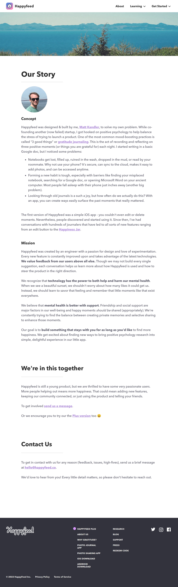

## why gratitude journaling?

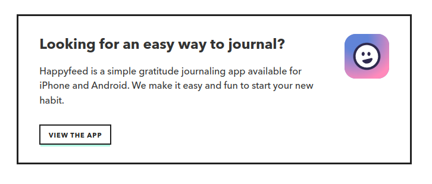

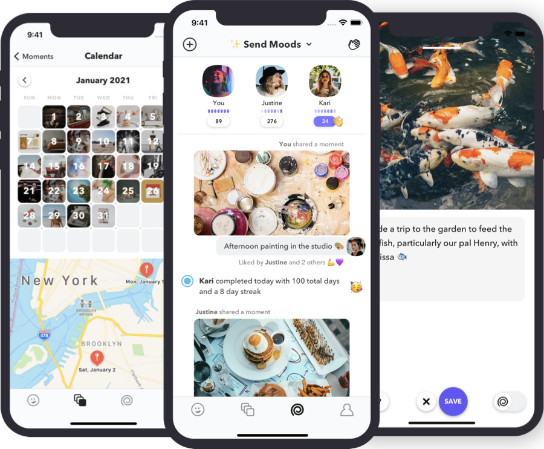

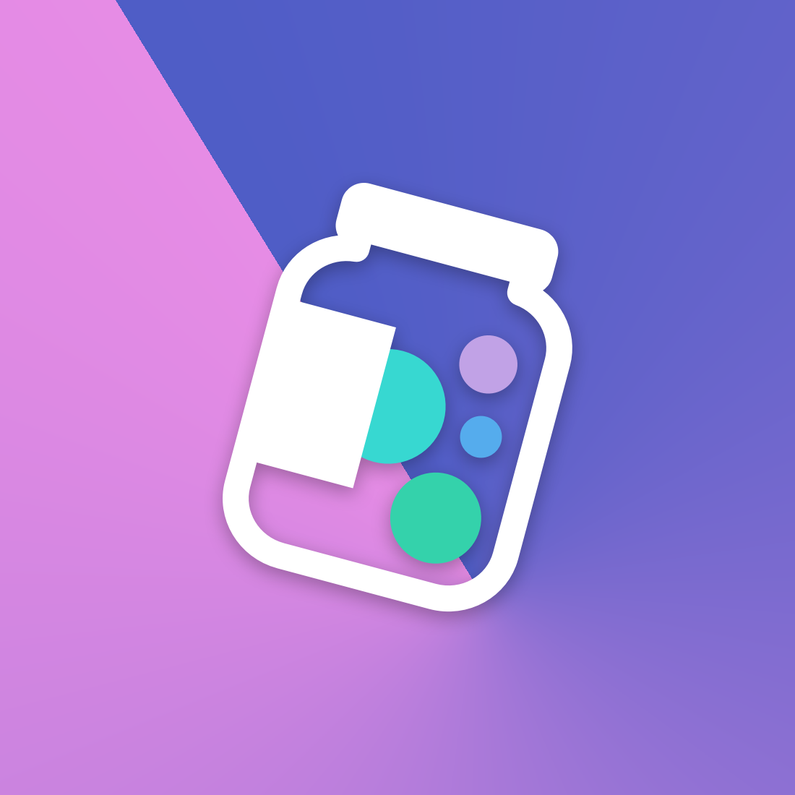

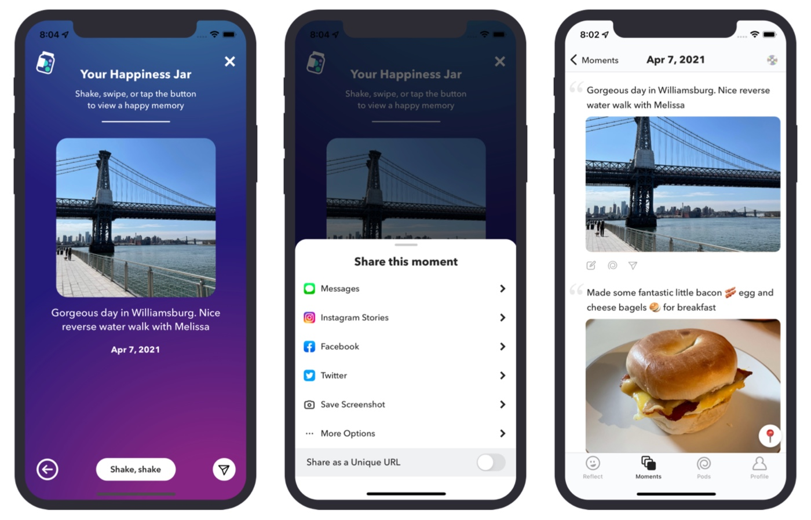

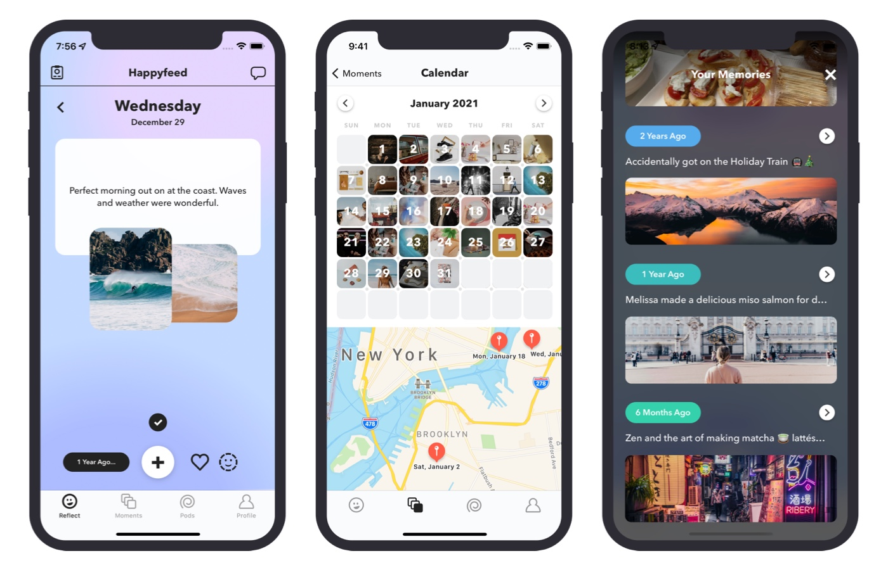

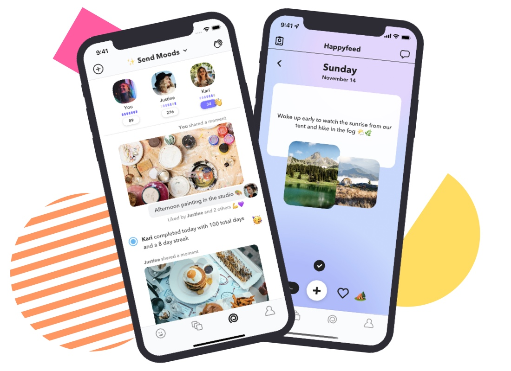

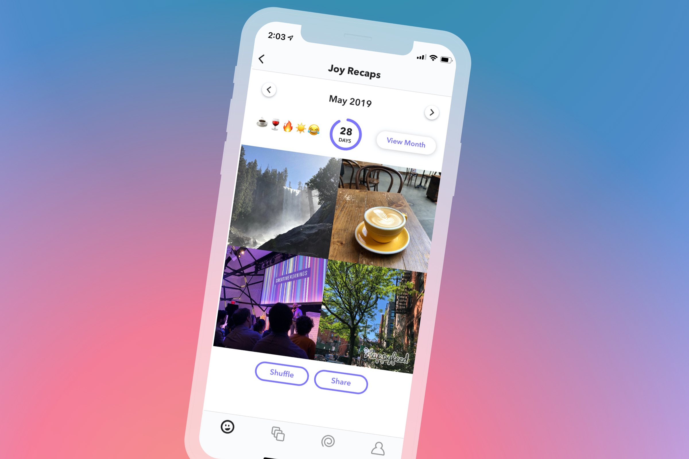

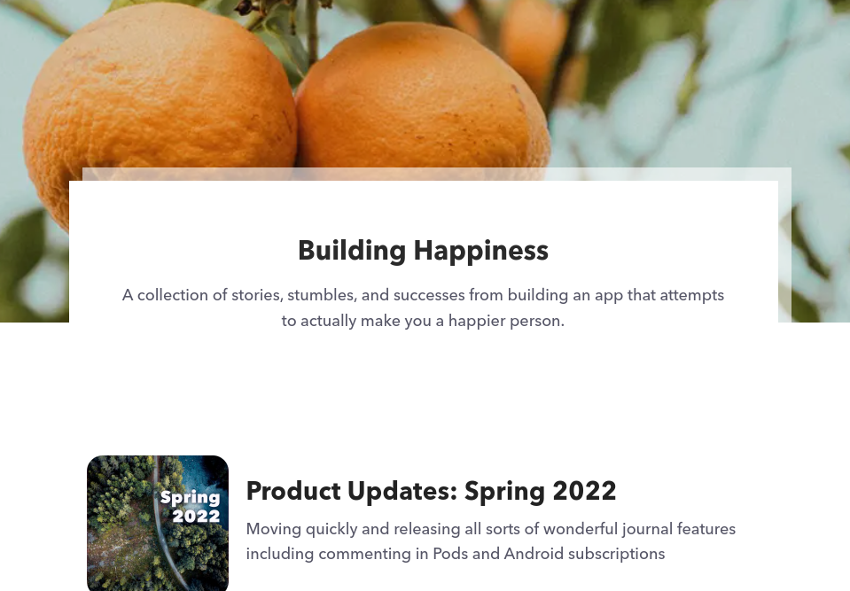

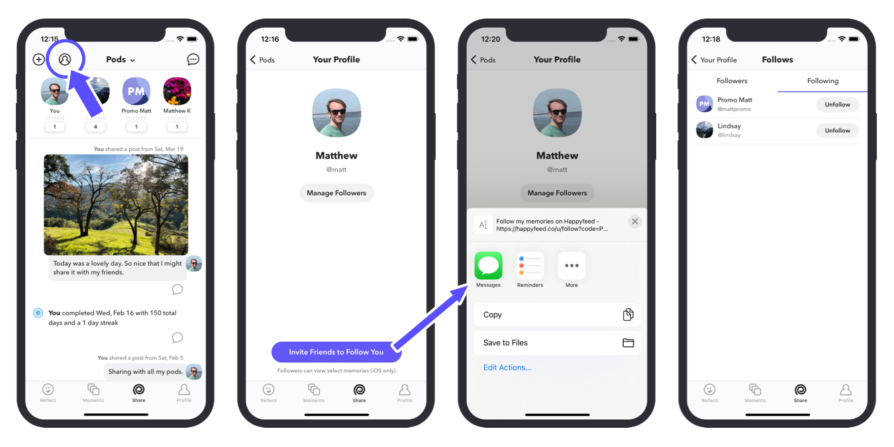

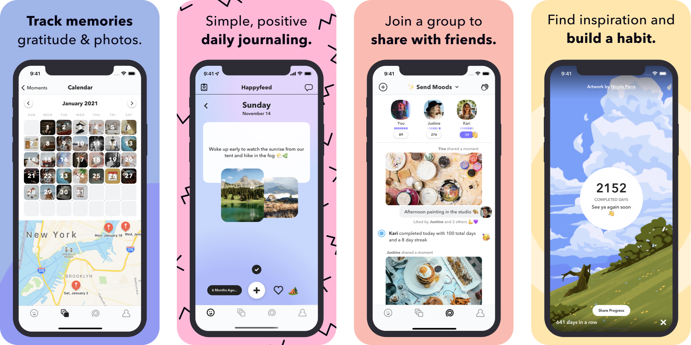

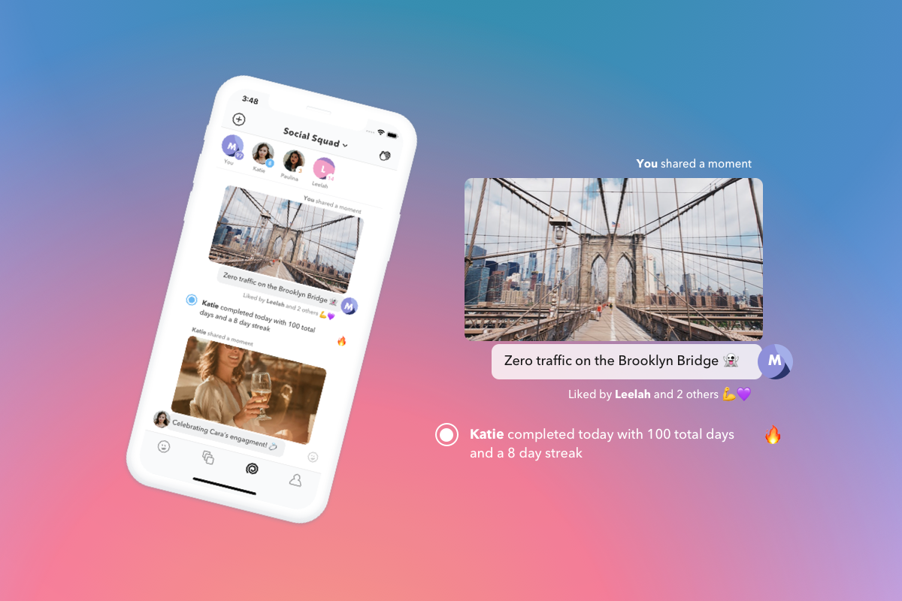